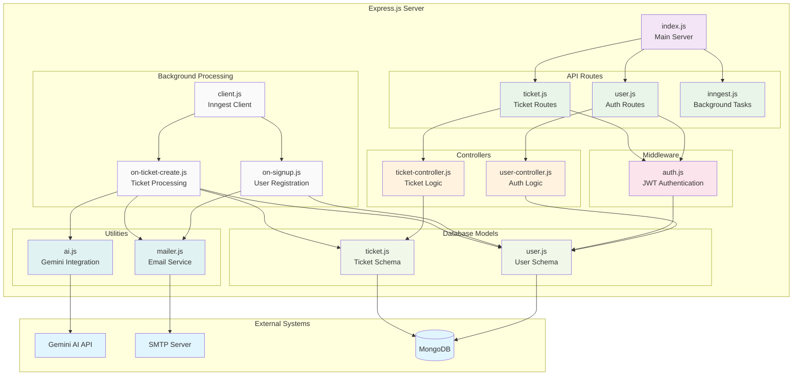
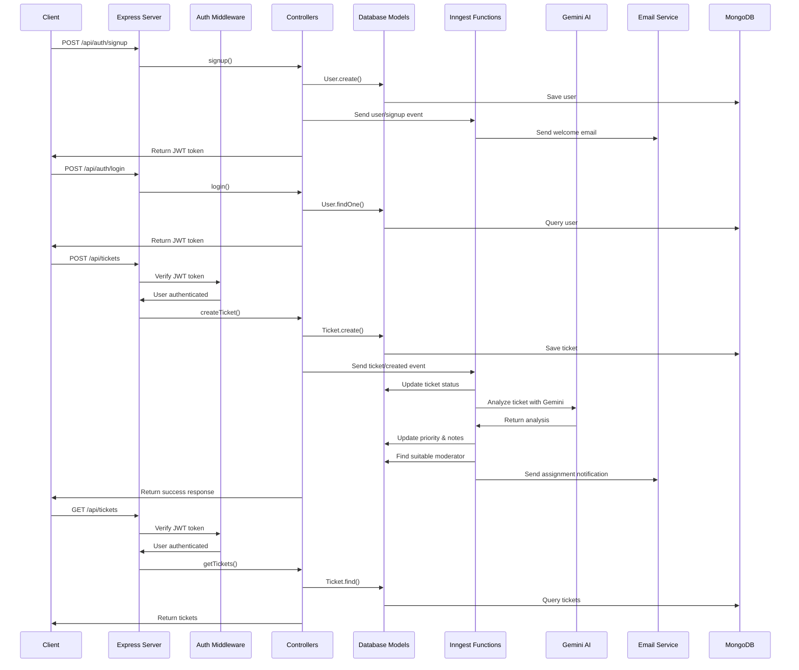
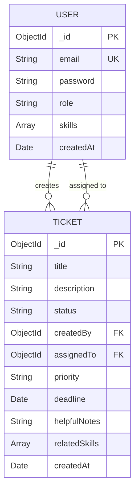
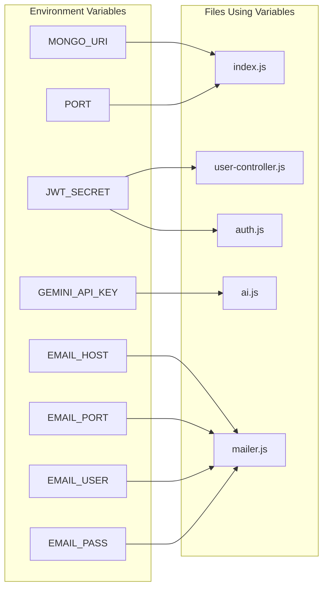

# AI Assistant Backend Architecture

## System Architecture Diagram



## Data Flow Diagram



## Database Schema Diagram



## Environment Variables Dependencies



## How to View These Diagrams

### Option 1: GitHub (Recommended)
1. Push this file to your GitHub repository
2. GitHub automatically renders Mermaid diagrams in markdown files
3. View the rendered diagrams directly on GitHub

### Option 2: VS Code Extension
1. Install the "Markdown Preview Mermaid Support" extension
2. Open the `ARCHITECTURE.md` file
3. Press `Ctrl+Shift+V` (or `Cmd+Shift+V` on Mac) to open preview
4. The diagrams will be rendered in the preview

### Option 3: Online Mermaid Editor
1. Go to [Mermaid Live Editor](https://mermaid.live/)
2. Copy the diagram code (between the ```mermaid blocks)
3. Paste it into the editor
4. View the rendered diagram

### Option 4: Local Development
1. Install Mermaid CLI: `npm install -g @mermaid-js/mermaid-cli`
2. Generate PNG: `mmdc -i ARCHITECTURE.md -o architecture.png`
3. Or generate SVG: `mmdc -i ARCHITECTURE.md -o architecture.svg`

## Key Architecture Features

### 🔐 Authentication & Authorization
- JWT-based authentication
- Role-based access control (user, moderator, admin)
- Middleware protection for routes

### 🎫 Ticket Management
- CRUD operations for tickets
- AI-powered ticket analysis
- Automatic priority assignment
- Moderator assignment based on skills

### 🤖 AI Integration
- Gemini AI for ticket analysis
- Automatic priority detection
- Skill requirement identification
- Helpful notes generation

### 📧 Background Processing
- Inngest for async task processing
- Email notifications
- Welcome emails on signup
- Ticket assignment notifications

### 🗄️ Database Design
- MongoDB with Mongoose ODM
- User and Ticket schemas
- Proper relationships and indexing
- Role-based data access

This architecture provides a scalable, maintainable backend system with modern practices like background processing, AI integration, and proper separation of concerns. 